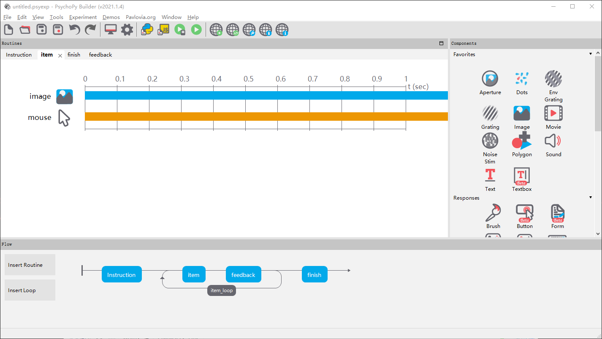
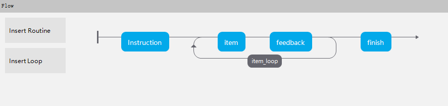
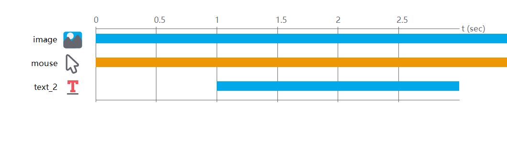
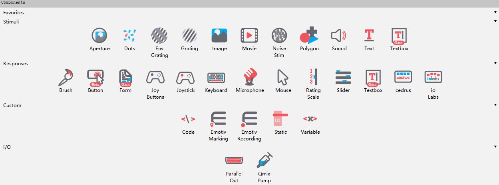
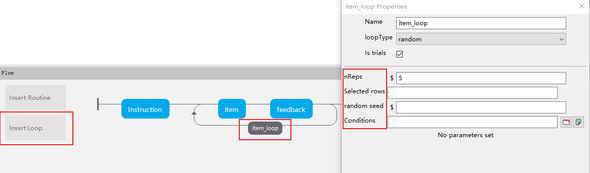
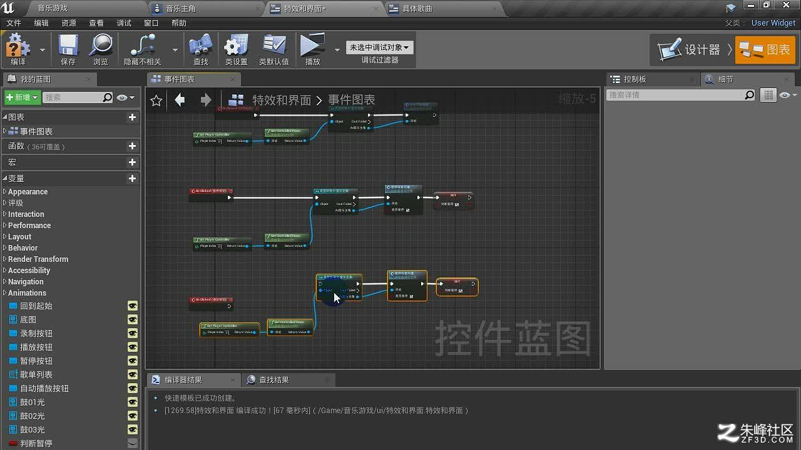
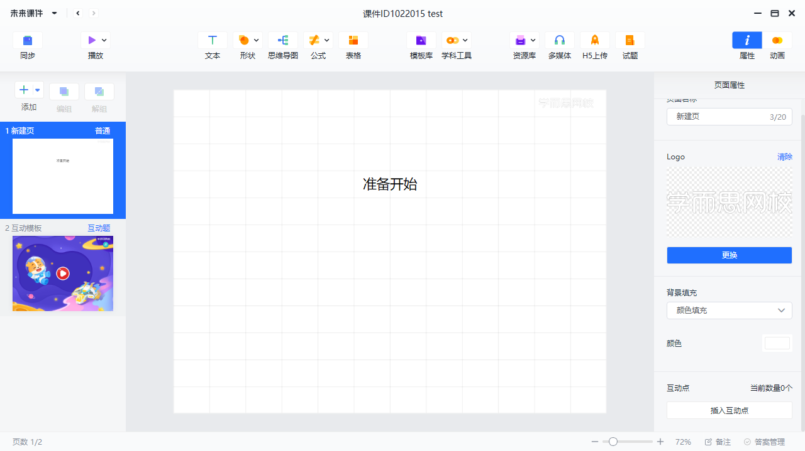
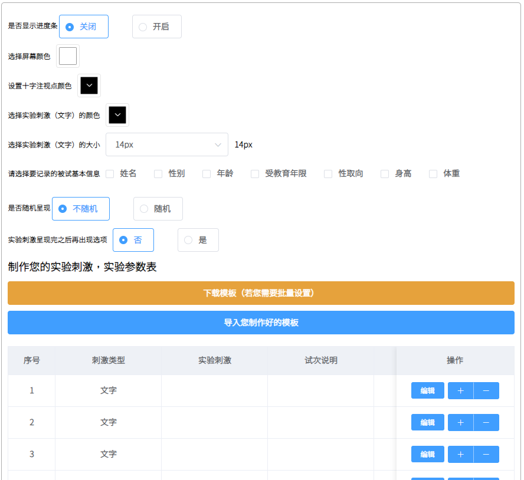

# 第十七讲 补充 PsychoPy
PsychoPy是什么？是一个基于Python开发的实验编制工具，是一个Python的包，也可以作为一个独立的软件呈现和使用。具有图形界面，支持可视化模块化编程，每个模块也有独立的API，支持纯代码模式编写。并且可视化编辑的实验可以本地使用，也可以通过自动的Python→JS的转换，实现基于浏览器的在线实验。

[PsychoPy官网](https://www.psychopy.org/ "PsychoPy官网")

[在线实验平台](https://pavlovia.org/ "Pavlovia官网")

本次分享重点在讨论可视化编辑的部分

## 整体逻辑
以时间为事件排列的轴，并且以组块化和重复为核心的任务生成

### 时间轴

整体事件顺序

单个模块时间排列

### 组块化

呈现、操作、自定义、输入输出四个大类

### 重复

设置在同一逻辑内以不同的材料作为内容的循环

以表单作为内容接入方式

## 组块逻辑
应对不同的呈现、操作、输入输出方式，打包设计成不同的组块，以参数的形式调节每个组块

变化逻辑：固定不变，按每次重复变，按每帧变

examples see Demos

## 一些其它工具
### Unreal Engine 4

T-Creator模仿的对象，本质也是不同组块的逻辑连接

### 未来课件

类似PPT的组合逻辑

单个页面可以套入文字、图片、思维导图、H5页面、游戏模板等

### AirCogSci

[http://www.aircogsci.com/](http://www.aircogsci.com/)

以表单模式做设置

## 实验逻辑与游戏逻辑的区别
### 实验
以时间为锚，排布好需要发生的事件

### 游戏
以空间为锚，在场景中完成事件

## 关于cocos与实验逻辑结合的思考
### 基于原有T-Creator的思路
使用cocos完成单题的逻辑创建，使用组合工具将其编入

中间再关联题库、素材库等

### 以时间为锚的设计思路做整体编排
将时间轴和重复的逻辑放到新的任务生成工具中

任务库、题库、素材库可做接入

### 以切片为锚的设计思路做拼接
从不同切片出发做循环和重复，切片间有输入和输出的接口

## 讨论
基于输入有什么新的想法？