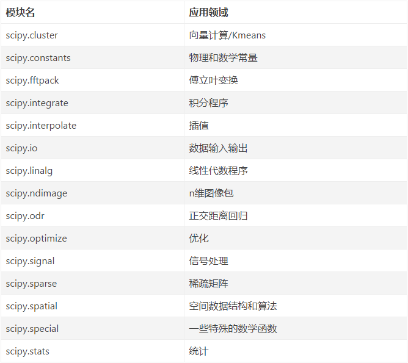

# 第八讲 numpy & scipy

## NumPy

NumPy(Numerical Python) 

重点是支持维度数组及向量与矩阵运算

[https://www.runoob.com/numpy/numpy-tutorial.html](https://www.runoob.com/numpy/numpy-tutorial.html)

[https://www.numpy.org.cn/article/](https://www.numpy.org.cn/article/)

### NumPy Ndarray 对象
NumPy 最重要的一个特点是其 N 维数组对象 ndarray，它是一系列同类型数据的集合

numpy.array(object, dtype = None, copy = True, order = None, subok = False, ndmin = 0)

object为建立数组的内容，dtype数组元素数据类型，ndmin指定生成数组的最小维度

	import numpy as np
	
	# 例1 创建1维数组
	
	np.array([1,2,3])  	
	np.arange(5)
	
	# 例2 创建2维数组
	
	np.array([[1, 2],  [3, 4]])
	
	# 例3 创建3维数组
	
	np.array([[1, 2, 3],  [4, 5, 6], [7, 8, 9]])
	# 创建未初始化的数组
	np.empty((2,2), dtype=int)
	# 创建以0为元素的数组
	np.zeros((2,2))
	# 创建以1为元素的数组
	np.ones([2,2])

### NumPy数据类型
[https://www.runoob.com/numpy/numpy-dtype.html](https://www.runoob.com/numpy/numpy-dtype.html)

### NumPy数组属性
[https://www.runoob.com/numpy/numpy-array-attributes.html](https://www.runoob.com/numpy/numpy-array-attributes.html)

### NumPy的字符串函数
[https://www.runoob.com/numpy/numpy-string-functions.html](https://www.runoob.com/numpy/numpy-string-functions.html)

### NumPy的数学函数
[https://www.runoob.com/numpy/numpy-mathematical-functions.html](https://www.runoob.com/numpy/numpy-mathematical-functions.html)

### NumPy的算术函数
[https://www.runoob.com/numpy/numpy-arithmetic-operations.html](https://www.runoob.com/numpy/numpy-arithmetic-operations.html)

### NumPy的统计函数
[https://www.runoob.com/numpy/numpy-statistical-functions.html](https://www.runoob.com/numpy/numpy-statistical-functions.html)

### NumPy线性代数
[https://www.runoob.com/numpy/numpy-linear-algebra.html](https://www.runoob.com/numpy/numpy-linear-algebra.html)

	# 例4 使用numpy解线性方程

	import numpy as np 
	 
	a = np.array([[1,1,1],[0,2,5],[2,5,-1]])
	b = np.array([[6],[-4],[27]])
	
	x = np.linalg.solve(a,b) 
	print (x)

## SciPy
SciPy（Scientific Python）常用于科学计算

NumPy 通常与 SciPy 和 Matplotlib一起使用，这种组合广泛用于替代 MatLab，是一个强大的科学计算环境，有助于我们通过 Python 学习数据科学或者机器学习

[https://iowiki.com/scipy/scipy_index.html](https://iowiki.com/scipy/scipy_index.html)

[https://docs.scipy.org/doc/scipy/reference/index.html](https://docs.scipy.org/doc/scipy/reference/index.html)

###scipy.stats

[https://docs.scipy.org/doc/scipy/reference/stats.html](https://docs.scipy.org/doc/scipy/reference/stats.html)